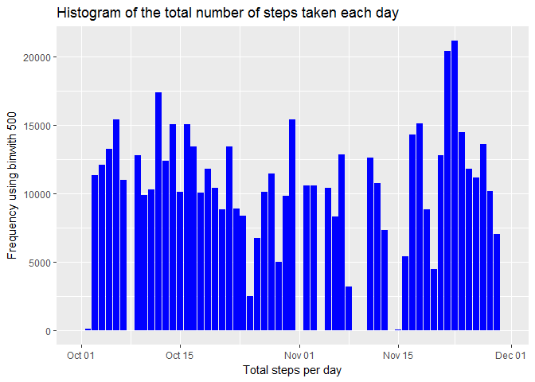
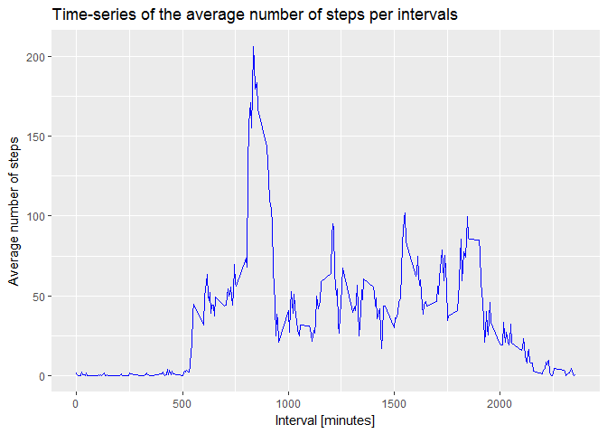
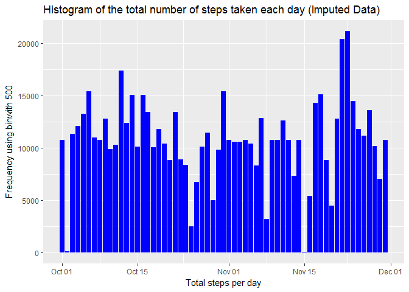
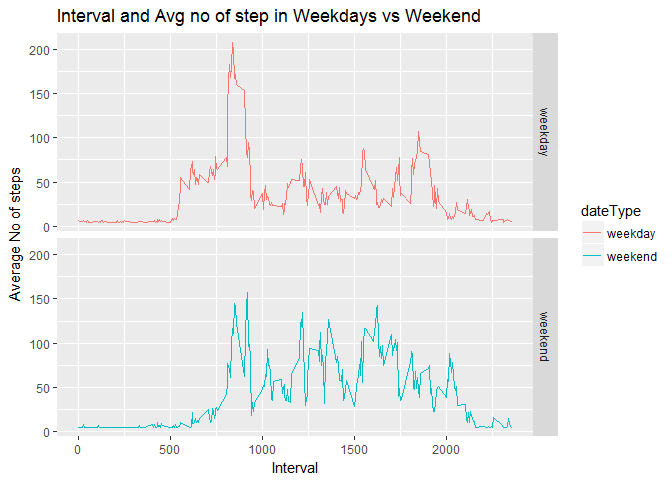

# Reproducible Research: Peer Assessment 1
Biswajeet Sahoo  
September 27, 2017  


```r
library(dplyr)
```

```
## 
## Attaching package: 'dplyr'
```

```
## The following objects are masked from 'package:stats':
## 
##     filter, lag
```

```
## The following objects are masked from 'package:base':
## 
##     intersect, setdiff, setequal, union
```

```r
library(ggplot2)
library(Hmisc)
```

```
## Loading required package: lattice
```

```
## Loading required package: survival
```

```
## Loading required package: Formula
```

```
## 
## Attaching package: 'Hmisc'
```

```
## The following objects are masked from 'package:dplyr':
## 
##     combine, src, summarize
```

```
## The following objects are masked from 'package:base':
## 
##     format.pval, round.POSIXt, trunc.POSIXt, units
```


## Loading and preprocessing the data


```r
if(!file.exists('activity.csv')){
    unzip('activity.zip')
}
activityData <- read.csv('activity.csv')
```


```r
activityData$date <- as.Date(activityData$date, format = "%Y-%m-%d")
```


## What is mean total number of steps taken per day?

1. Calculate the total number of steps taken per day.


```r
#stepsByDay <- tapply(activityData$steps, activityData$date, sum, na.rm=TRUE)
stepsByDay <- activityData %>%
    group_by(date) %>%
    summarise(sum = sum(steps, na.rm = TRUE)) 
```

2. Make a histogram of the total number of steps taken each day.


```r
ggplot(data = stepsByDay, aes(x= date, y= sum)) +
    geom_histogram(stat = "identity", fill = "blue") +
     xlab("Total steps per day") +
     ylab("Frequency using binwith 500") +
    ggtitle("Histogram of the total number of steps taken each day ")
```

```
## Warning: Ignoring unknown parameters: binwidth, bins, pad
```

<!-- -->

3. Calculate and report the mean and median of the total number of steps taken per day


```r
stepsByDayMean <- mean(stepsByDay$sum)
stepsByDayMedian <- median(stepsByDay$sum)
```

* Mean: 9354.2295082
* Median: 10395

Removing stepsByDay to save memory

```r
rm(stepsByDay)
```


## What is the average daily activity pattern?

1. Make a time series plot (i.e. type = "l") of the 5-minute interval (x-axis) and the average number of steps taken, averaged across all days (y-axis)


```r
MeanStepsByInterval <- activityData %>%
    group_by(interval) %>%
    summarise(mean = mean(steps, na.rm = TRUE)) 
```


```r
ggplot(data = MeanStepsByInterval, aes(x= interval, y= mean)) +
    geom_line(color = "blue") +
    xlab("Interval [minutes]") + 
    ylab("Average number of steps") + 
    ggtitle("Time-series of the average number of steps per intervals" )
```

<!-- -->

2. Which 5-minute interval, on average across all the days in the dataset, contains the maximum number of steps?


```r
moststeps <- MeanStepsByInterval[which.max(MeanStepsByInterval$mean),]
```

The 5-minute interval that contains the maximum of steps, on average across all days, is 835


Removing MeanStepsByInterval and moststeps to save memory.

```r
rm(MeanStepsByInterval)
rm(moststeps)
```

## Imputing missing values

1. Calculate and report the total number of missing values in the dataset (i.e. the total number of rows with NA's)


```r
num <- sum(is.na(activityData$steps))
```

The number of NA's is 2304

Removing num to save memory.

```r
rm(num)
```

2. Devise a strategy for filling in all of the missing values in the dataset. The strategy does not need to be sophisticated. For example, you could use the mean/median for that day, or the mean for that 5-minute interval, etc.

"Going to use impute function in next step"

3. Create a new dataset that is equal to the original dataset but with the missing data filled in.


```r
activityDataImputed <- activityData
activityDataImputed$steps <- impute(activityData$steps, fun=mean)
```

4. Make a histogram of the total number of steps taken each day and Calculate and report the mean and median total number of steps taken per day. Do these values differ from the estimates from the first part of the assignment? What is the impact of imputing missing data on the estimates of the total daily number of steps?


```r
stepsByDayimp <- activityDataImputed %>%
    group_by(date) %>%
    summarise(sum = sum(steps, na.rm = TRUE)) 

ggplot(data = stepsByDayimp, aes(x= date, y= sum)) +
    geom_histogram(stat = "identity", fill = "blue") +
     xlab("Total steps per day") +
     ylab("Frequency using binwith 500") +
    ggtitle("Histogram of the total number of steps taken each day (Imputed Data) ")
```

```
## Warning: Ignoring unknown parameters: binwidth, bins, pad
```

<!-- -->


```r
stepsByDayMean <- mean(stepsByDayimp$sum)
stepsByDayMedian <- median(stepsByDayimp$sum)
```

* Mean: 1.0766189\times 10^{4}
* Median: 1.0766189\times 10^{4}

Removing stepsByDayimp to save memory

```r
rm(stepsByDayimp)
```


## Are there differences in activity patterns between weekdays and weekends?

1. Create a new factor variable in the dataset with two levels - "weekday" and "weekend" indicating whether a given date is a weekday or weekend day.


```r
activityDataImputed$dateType <-  ifelse(as.POSIXlt(activityDataImputed$date)$wday %in% c(0,6), "weekend", "weekday")
```

2. Make a panel plot containing a time series plot (i.e. type = "l") of the 5-minute interval (x-axis) and the average number of steps taken, averaged across all weekday days or weekend days (y-axis). See the README file in the GitHub repository to see an example of what this plot should look like using simulated data.


```r
str(activityDataImputed)
```

```
## 'data.frame':	17568 obs. of  4 variables:
##  $ steps   :Class 'impute'  atomic [1:17568] 37.4 37.4 37.4 37.4 37.4 ...
##   .. ..- attr(*, "imputed")= int [1:2304] 1 2 3 4 5 6 7 8 9 10 ...
##  $ date    : Date, format: "2012-10-01" "2012-10-01" ...
##  $ interval: int  0 5 10 15 20 25 30 35 40 45 ...
##  $ dateType: chr  "weekday" "weekday" "weekday" "weekday" ...
```

```r
stepsByDaytype <- activityDataImputed %>%
    group_by(interval, dateType) %>%
    summarise(mean = mean(steps, na.rm = TRUE)) 

ggplot(data = stepsByDaytype, aes(x= interval, y= mean)) +
    geom_line(aes(color = dateType)) +
    facet_grid(dateType~.) +
     xlab("Interval") +
     ylab("Average No of steps") +
    ggtitle("Interval and Avg no of step in Weekdays vs Weekend")
```

<!-- -->

Removing stepsByDaytype to save memory

```r
rm(stepsByDaytype)
```


